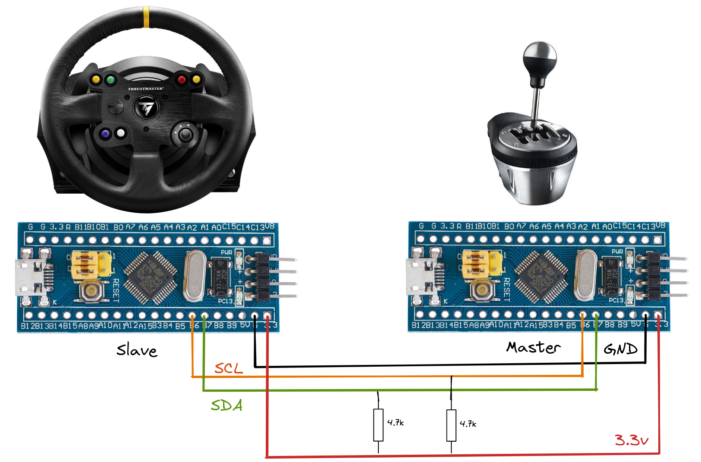

# Thrustmaster TH8A Emulator Research

## Notes

TSS Sparco handbrake I2C data

```
02 0C 02 00 FF 80 81 80 81 00 00 00 00 00

02 0C 02 00 8A 80 4D 80 4D 00 00 00 00 00

02 0C 02 00 82 80 4A 80 4A 00 00 00 00 00

02 0C 02 01 17 7F 20 7F 20 00 00 00 00 00

02 0C 02 01 0F 7F 1D 7F 1D 00 00 00 00 00
```

> Above TSS handbrake's I2C data mean about 0-100% brake force. Of course you need to send out every row maybe 100 times. Because of 250ms. Elsewhere you won't see anything.

```js
0  02 02 02 02 02 // TSS handbrake
1  0C 0C 0C 0C 0C // Unknown
2  02 02 02 02 02 // ?? Device ID
3  00 00 00 01 01 // Unknown
4  FF 8A 82 17 0F // Unknown
5  80 80 80 7F 7F // Unknown ◄─┐
6  81 4D 4A 20 1D // Unknown ◄─│─┐
7  80 80 80 7F 7F // Unknown ◄─┘ │
8  81 4D 4A 20 1D // Unknown ◄───┘
9  00 00 00 00 00 // Unknown
A  00 00 00 00 00 // Unknown
B  00 00 00 00 00 // Unknown
C  00 00 00 00 00 // Unknown
D  00 00 00 00 00 // Unknown
```

### I2C Connection

- VDD -> RED
- VSS -> GND
- I2C-SCL -> WHITE
- I2C-SDA -> GREEN

## Connection Diagram



## STM32 "Blue Pill" Pin Diagram


## References

- [USB Shifter to Thrustmaster Wheelbase](https://github.com/azzajess/USB-Shifter-to-Thrustmaster-Wheelbase)
- [Awesome Arduino](https://github.com/Lembed/Awesome-arduino)
