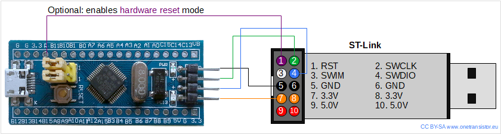
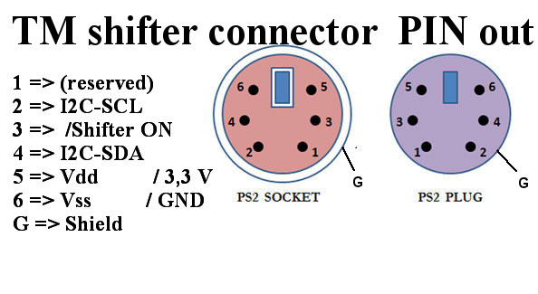

# Thrustmaster TH8A Emulator Research

This repository contains a research on an attempt to simulate the Thrustmaster's TH8A shifter add-on using I2C protocol. It heavily relies on [the original project](https://github.com/azzajess/USB-Shifter-to-Thrustmaster-Wheelbase) which implemented this functionality using the Arduino ecosystem. In this case, [TinyGo with STM32 'Bluepill' controller](https://tinygo.org/docs/reference/microcontrollers/bluepill/) was used for this purpose. This project lacks support for a generic USB shifter, because STM32 does not support USB host functionality. However, the core functionality is in place and the human input could be registered using controller's GPIO/ADC capabilities.


## Project Structure

```bash
shifter/                    # contains code for simulating the th8a shifter 
    gears
    gears/gears_test.go
    gears/gears.go
    go.mod
    Makefile
    main.go

logic-capture/              # contains signal capture data going from the actual th8a to TM wheel base
    TH8A seq.vcd            # sequential gear mode: up, down, center
    TH8A N-1-N-1.logicdata  # H type gear neutral to first gear
    TH8A seq.logicdata
    TH8A N-1-N-1.vcd

Dockerfile                  # defines development container setup for VS code
Makefile                    # used to automate common tasks

arduino/                    # sample Arduino code related to TH8A simulation 
    TH8A_FX.ino
    TH8A_FX_TEST.ino
    i2c-scanner.ino
    G27_to_TH8A.ino
    USBShifter2PS2.ino

.devcontainer/devcontainer.json # VSCode development container configuration

go.work                     # defines go workspaces
README.md

wheel/                      # simulates TM wheel based in order to enable quicker development cycle when testing the th8s emulator
    i2c
    i2c/i2c.go
    gears
    gears/gears_test.go
    gears/gears.go
    go.mod
    Makefile
    main.go
```

## Development

***Note**: The project uses [Visual Studio Code development containers](https://code.visualstudio.com/docs/devcontainers/containers) to bootstrap TinyGo development environment. If you would choose to use some other way for development, please adjust accordingly.*

The TH8A emulator code is stored in the [`shifter`](./shifter/) directory. The current default functionality is to read key presses from UART and switch gears accordingly. However, it could be changed in any other way. The most common commands during the development and testing are presented below. The same commands apply for the [`wheel`](./wheel/) module.

```bash
# switch directory
cd ./wheel

# build binary for STM32 'blue pill'
tinygo build -target=bluepill -o main.bin main.go

# flash controller using the compiled binary
tinygo flash -target=bluepill
```

### Uploading Binaries

[TinyGo](https://tinygo.org/docs/reference/microcontrollers/bluepill/#flashing) uses [openocd](https://github.com/STMicroelectronics/OpenOCD) with [ST-LINK/V2](https://www.st.com/en/development-tools/st-link-v2.html) for flashing compiled binaries to STM32 controllers. Please see the connection diagram below.




### I2C Connection

*The below are personal notes on the cable used for connecting different pins. Please adjust it according to your own cable setup.*

- VDD -> RED
- VSS -> GND
- I2C-SCL -> WHITE
- I2C-SDA -> GREEN

## Connection Diagram

The image below describes how to connect two STM32 modules to simulate both the wheel base and the shifter add-on. Each module needs to be flashed with appropriated binary.


The below presents the DIN9 (PS2) pin out for TM wheel base.



## STM32 "Blue Pill" Pin Diagram


---

## Notes

TSS Sparco handbrake I2C data

```
02 0C 02 00 FF 80 81 80 81 00 00 00 00 00

02 0C 02 00 8A 80 4D 80 4D 00 00 00 00 00

02 0C 02 00 82 80 4A 80 4A 00 00 00 00 00

02 0C 02 01 17 7F 20 7F 20 00 00 00 00 00

02 0C 02 01 0F 7F 1D 7F 1D 00 00 00 00 00
```

> Above TSS handbrake's I2C data mean about 0-100% brake force. Of course you need to send out every row maybe 100 times. Because of 250ms. Elsewhere you won't see anything.

```
0  02 02 02 02 02 // TSS handbrake
1  0C 0C 0C 0C 0C // Unknown
2  02 02 02 02 02 // ?? Device ID
3  00 00 00 01 01 // Unknown
4  FF 8A 82 17 0F // Unknown
5  80 80 80 7F 7F // Unknown ◄─┐
6  81 4D 4A 20 1D // Unknown ◄─│─┐
7  80 80 80 7F 7F // Unknown ◄─┘ │
8  81 4D 4A 20 1D // Unknown ◄───┘
9  00 00 00 00 00 // Unknown
A  00 00 00 00 00 // Unknown
B  00 00 00 00 00 // Unknown
C  00 00 00 00 00 // Unknown
D  00 00 00 00 00 // Unknown
```

## References

- [USB Shifter to Thrustmaster Wheelbase](https://github.com/azzajess/USB-Shifter-to-Thrustmaster-Wheelbase)
- [Awesome Arduino](https://github.com/Lembed/Awesome-arduino)
- [Program "blue pill" with STM32 Cores in Arduino IDE](https://www.onetransistor.eu/2020/01/stm32-bluepill-arduino-support.html)